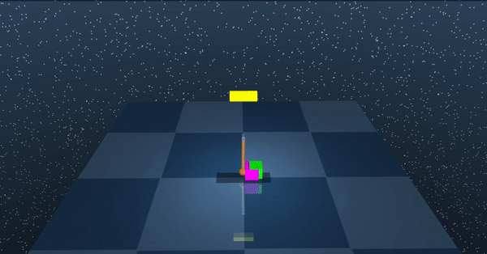
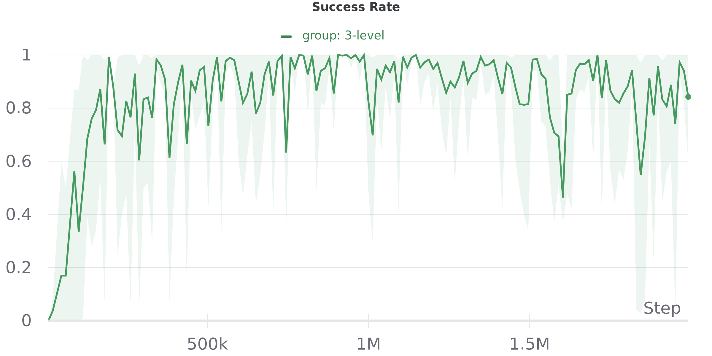

This is the repo that reproduce the results for continuous control domains presented in the paper "Learning Multi-Level Hierarchies with Hindsight" (ICLR 2019) in Pytorch. Original repo in Tensorflow is at https://github.com/andrew-j-levy/Hierarchical-Actor-Critc-HAC-. The repo is inspired from "https://github.com/nikhilbarhate99/Hierarchical-Actor-Critic-HAC-PyTorch". The difference is that I use the domains (Ant-Four-Room, Ant-Reacher, UR5-Reacher, Inverted-Pendulum) in the original paper, while the other repo does not (it uses two custom and simpler domains).

### Setup
- Install `pip3 install -e .`
- You will need MuJoCo to run

### Training (replace the number of layers with 2 or 3)
```python3 run_hac.py --n_layers 2 --env hac-inverted-pendulum-v0 --retrain --timesteps 2000000 --seed 0 --group 2-level```

### Visualizing the policy saved at results/logs/hac-inverted-pendulum-v0/2-levels/0
```python3 run_hac.py --n_layers 2 --env hac-inverted-pendulum-v0 --test --show --timesteps 2000000 --seed 0 --group 2-level```
- Inverted-Pendulum


### Learning Curves (Logged by Wandb)
- Inverted-Pendulum


### Saved policies are stored in saved_policies/
